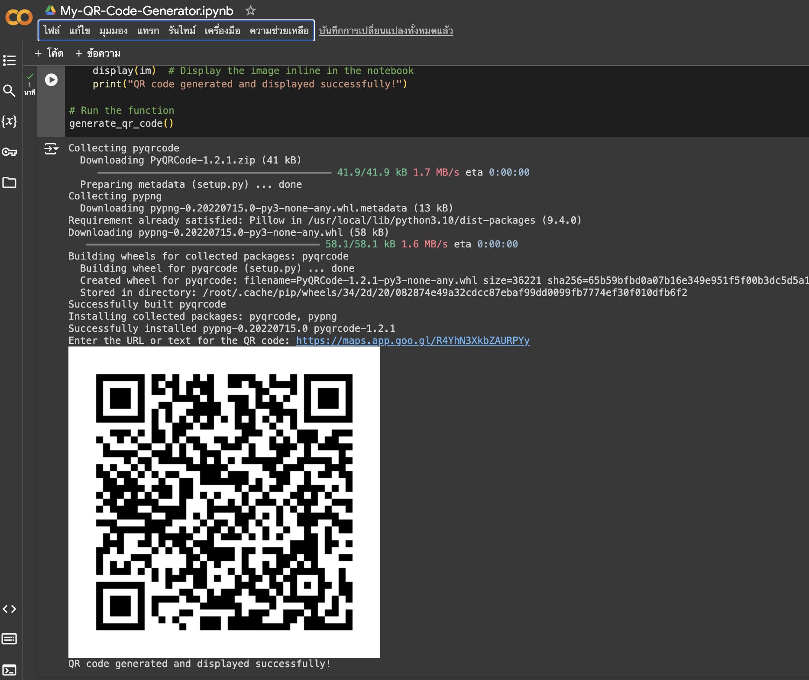

---

# QR Code Generation with Python in Jupyter Notebooks

This project demonstrates how to generate QR codes using Python within a Jupyter notebook, focusing on providing the best user interface (UI) and user experience (UX).

## Features

- **Interactive Input**: Users can input a URL or any text to generate a QR code.
- **Inline Display**: The generated QR code is displayed directly within the notebook for immediate feedback.
- **Ease of Use**: The script is simple and straightforward, making it accessible for users with minimal coding experience.

## Installation

To set up the environment, install the required libraries by running the following commands:

```bash
pip install pyqrcode pypng Pillow
```

## Usage

1. **Running the Code**:
    - Open the Jupyter notebook.
    - Run the cell containing the QR code generation script.
  
2. **Generating a QR Code**:
    - The script will prompt you to enter the URL or text you want to encode in the QR code.
    - After inputting the text, the QR code will be generated and displayed within the notebook.

3. **Viewing the QR Code**:
    - The QR code image is automatically displayed in the notebook.
    - The image is also saved as `qr-code.png` in your working directory.

## Code Example

```python
import pyqrcode
from PIL import Image
from IPython.display import display

def generate_qr_code():
    s = input("Enter the URL or text for the QR code: ")
    url = pyqrcode.create(s)
    img = "qr-code.png"
    url.png(img, scale=10)
    im = Image.open(img)
    display(im)
    print("QR code generated and displayed successfully!")

generate_qr_code()
```

## Output

After running the code, you'll see the generated QR code displayed directly in your Jupyter notebook. The image file `qr-code.png` is saved for further use or sharing.

## Screenshots



## License

This project is licensed under the MIT License. See the [LICENSE](LICENSE) file for details.

## Contact

For any inquiries or issues, please contact me!

## Author

- **Worachat W, Dev.** - *Data Science, Engineering & Full Stack Dev. 2024*  
  [LinkedIn](https://www.linkedin.com/in/brainwaves-your-ai-playground-82155961/) | [GitHub](https://github.com/worachat-dev) | [Facebook](https://web.facebook.com/NutriCious.Thailand)

---

This `README.md` provides a clear overview of the project, including installation instructions, usage steps, and a code example, helping users quickly understand how to use the QR code generation script in a Jupyter notebook.
